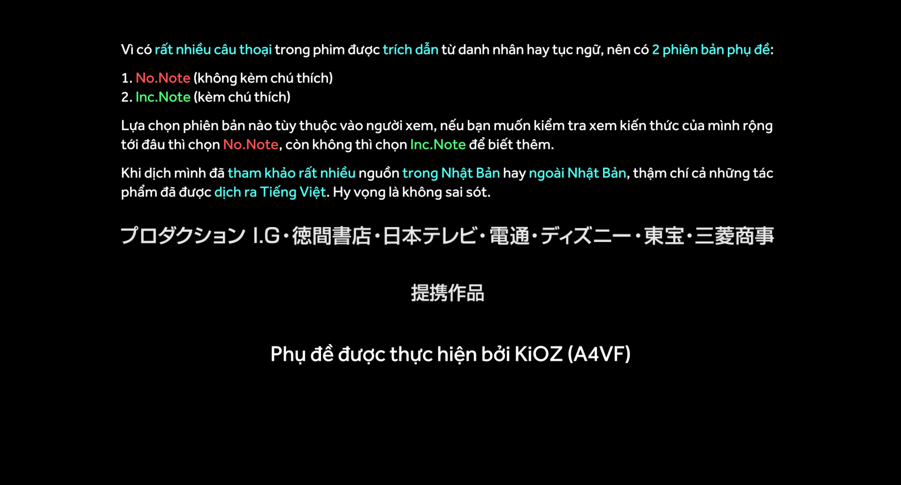
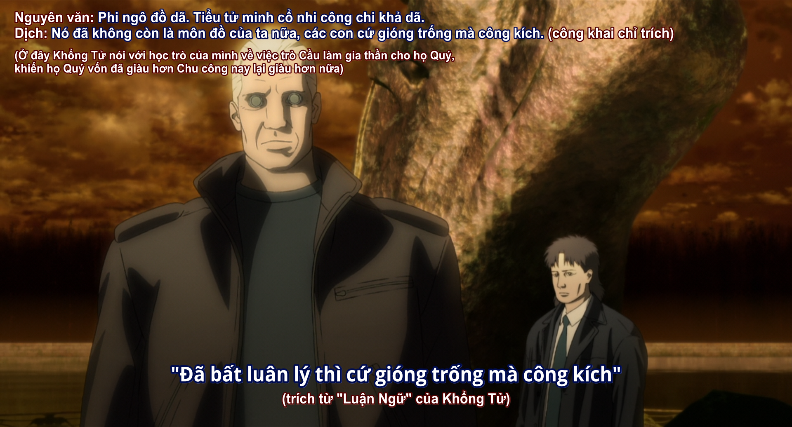
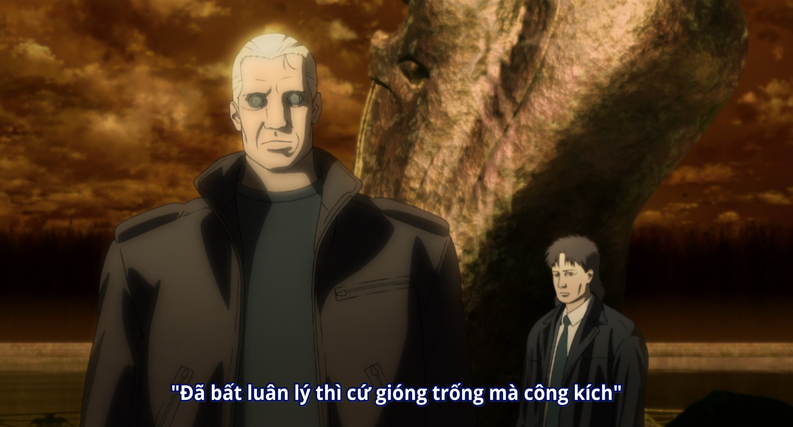
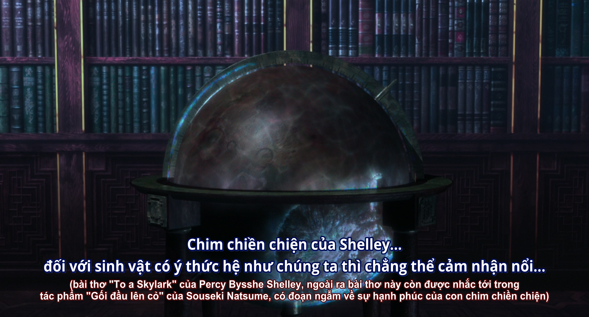
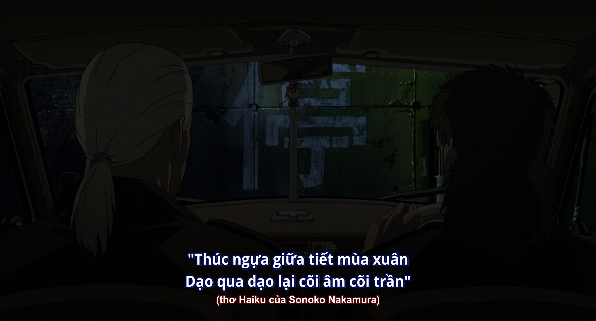
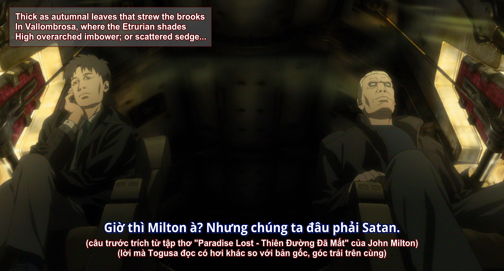
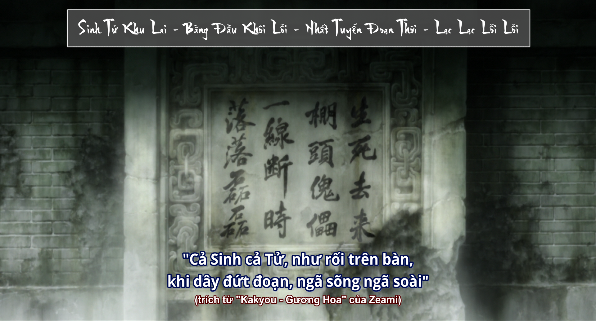

## Chú thích dịch

Phần này vô cùng, vô cùng nặng về thoại, khi dịch mình đã phải đi ngâm cứu ở các diễn đàn bên Nhật rất nhiều, đến cả họ, những người bản địa cũng thấy những câu thoại trong phim rất khó hiểu. Nên hãy cứ thong thả, nếu có chưa hiểu ngay được thì xem lại, ngẫm lại, còn mệt quá thì thôi kệ đi @@.

 Cả thảy đâu đấy có **hơn 40 note** được mình đưa vào phụ đề, bao gồm nhiều trích dẫn và chú thích dịch, nên phần nào đó sẽ gây khó chịu khi xem, chính vì thế mà chúng ta có 2 bản phụ đề:

- Inc.Note: kèm chú thích
- No.Note: không kèm chú thích

Đây là ví dụ về sự khác biệt giữa **Inc.Note** và **No.Note**

*Inc.Note*

*No.Note*

Phần lớn thông tin về các trích dẫn được mình tham khảo ở [đây](https://immigrantofthe150thyears.hatenablog.com/entry/2019/02/03/150107) và [đây](https://kazaha7.com/cine/?p=346) (cả 2 đều Tiếng Nhật), chiếm đâu đó 80%, ngoài ra cũng đã double check và tìm hiểu thêm cho nhiều trích dẫn, tiếc là giờ mình không còn lưu lại nhiều. Chủ yếu được tham khảo từ các nguồn Tiếng Nhật và Tiếng Anh, và cả Tiếng Việt, như là thông tin về tác phẩm "Gối đầu lên cỏ" của "Natsume Sōseki".
(mình sẽ để một số dưới phần [Notes](ghost-in-the-shell-02-2004.html#notes))

*"Gối đầu lên cỏ" của "Natsume Sōseki"*

Dưới đây là ví dụ cho một vài dạng chú thích có trong phim:

*dịch haiku sang lục bát*

*trích dẫn nhưng khác với bản gốc*

*bài thơ quan trọng trong phim*

>Nếu bảo đâu là bộ mà dịch tốn công nhất, thì chắc chắn là bộ này, mình khá tự hào về bản dịch, bên cạnh các bộ như "Monogatari Series" hay "các movie của Ghibli".

## Tham khảo thêm

[The Anti-Anthropocentrism of Ghost in the Shell 2: Innocence](https://www.animemangastudies.com/2020/05/06/guest-essay-towards-a-new-posthuman/?fbclid=IwAR3QSkaKiIBQjF4b2fsymSAJ9UL50rh9Szi5-y2K5zEi33ugxfPSriQNdls) (Essay)

## Notes

### Liệt kê trích dẫn

<https://immigrantofthe150thyears.hatenablog.com/entry/2019/02/03/150107>
<https://kazaha7.com/cine/?p=346>

### Các thông tin liên quan

<https://en.wikipedia.org/wiki/Francine_Descartes>

<https://en.wikipedia.org/wiki/Ren%C3%A9_Descartes>

<https://www.cambridge.org/core/journals/modern-intellectual-history/article/mechanical-daughter-of-rene-descartes-the-origin-and-history-of-an-intellectual-fable/14518C7D691F1B35B7504418B935D8A1>

<http://batomotoningyou.cocolog-nifty.com/batousannnikiitemiyou/2012/10/post-57de-1.html>

<https://immigrantofthe150thyears.hatenablog.com/entry/2019/02/20/180555>

<https://www.ln.edu.hk/lle/cwd02/seeking/confucius.html>

<http://bactra.org/LaMettrie/Machine/>

<https://diendanlequydon.com/viewtopic.php?t=397105&tn=goi-dau-len-co-natsume-soseki> (dead)

<https://en.wikipedia.org/wiki/Sacred_geometry>

<https://guruth.medium.com/2022-creating-a-lexicon-of-future-362daae96da1>

<https://meaning-dictionary.com/%E3%80%8C%E6%80%9D%E3%81%84%E5%87%BA%E3%80%8D%E3%81%A8%E3%80%8C%E6%83%B3%E3%81%84%E5%87%BA%E3%80%8D%E3%81%A8%E3%80%8C%E8%A8%98%E6%86%B6%E3%80%8D%E3%81%AE%E9%81%95%E3%81%84%E3%81%A8%E3%81%AF%EF%BC%9F/>

<https://type-r.hatenablog.com/entries/2005/04/24>

<https://wired.jp/2004/09/21/%e6%8a%bc%e4%ba%95%e5%ae%88%e7%9b%a3%e7%9d%a3%e3%81%ae%e3%82%a2%e3%83%8b%e3%83%a1%e6%98%a0%e7%94%bb%e3%80%8e%e3%82%a4%e3%83%8e%e3%82%bb%e3%83%b3%e3%82%b9%e3%80%8f%e3%80%81%e7%b1%b3%e5%9b%bd%e4%ba%ba/>
