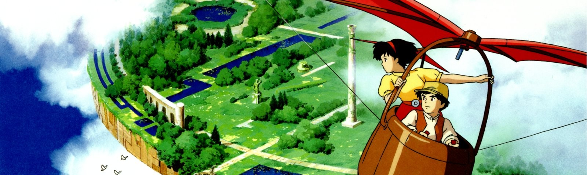
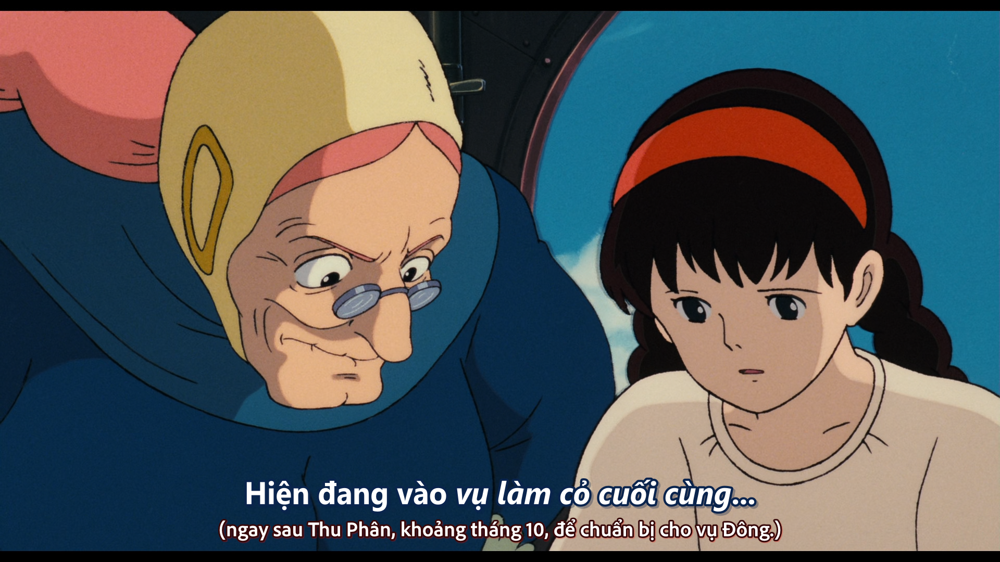
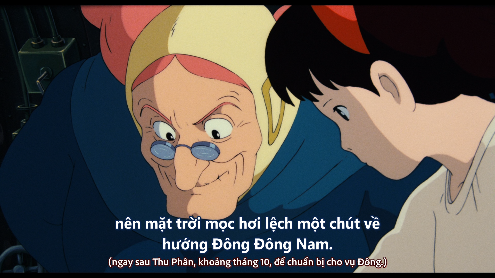
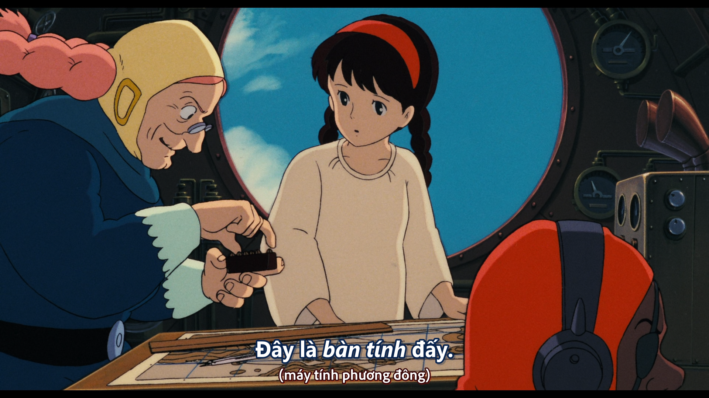

## Tenkū no Shiro Laputa (Laputa: Lâu đài trên không)

**
Studio: [Studio Ghibli]
**
**
Director: Miyazaki Hayao
**
**
▼ Download ▼
**

[Studio Ghibli]: https://myanimelist.net/anime/producer/21/Studio_Ghibli
[Kyoto Animation]: https://myanimelist.net/anime/producer/2/Kyoto_Animation
[Production I.G]: https://myanimelist.net/anime/producer/10/Production_IG
[Madhouse]: https://myanimelist.net/anime/producer/11/Madhouse
[MAPPA]: https://myanimelist.net/anime/producer/569/MAPPA
[ufotable]: https://myanimelist.net/anime/producer/43/ufotable
[Wit Studio]: https://myanimelist.net/anime/producer/858/Wit_Studio
[Shaft]: https://myanimelist.net/anime/producer/44/Shaft
[Bones]: https://myanimelist.net/anime/producer/4/Bones
[Trigger]: https://myanimelist.net/anime/producer/803/Trigger
[Sunrise]: https://myanimelist.net/anime/producer/14/Sunrise
[CoMix Wave Films]: https://myanimelist.net/anime/producer/291/CoMix_Wave_Films
[Science SARU]: https://myanimelist.net/anime/producer/1591/Science_SARU
[Studio 4°C]: https://myanimelist.net/anime/producer/13/Studio_4%C2%B0C
[OLM]: https://myanimelist.net/anime/producer/28/OLM
[Studio Chizu]: https://myanimelist.net/anime/producer/555/Studio_Chizu
[Toei Animation]: https://myanimelist.net/anime/producer/18/Toei_Animation

## Nhân Lực

- **Dịch**: [KiOZ] (Chỉnh sửa từ Netflix)
- **Timing**: [KiOZ], [nedragrevev](https://github.com/nedragrevev)
- **Typesetting**: [KiOZ]
- **Encode**: [GOA](https://nyaa.si/view/1392874)
- **QC**: [KiOZ], [moch1oka]

[KiOZ]: https://github.com/realKiOZ
[moch1oka]: https://github.com/moch1oka
[tuilakhanh]: https://github.com/tuilakhanh
[Eagle]: https://github.com/MasterEagle2909

## Chú thích dịch

### Vụ làm cỏ cuối cùng

Tiếng Nhật:

    今は最後の草刈りの季節だから　日の出は真東より ちょっと南へ動いています

*thời gian - 1:07:54*

"最後の草刈りの季節 - saigo no kusakari no kisetsu" nghĩa đen là "mùa làm cỏ cuối cùng", rơi vào tầm tháng 10[^1], chính vì thế mới gọi là "cuối cùng". Điều này cho thấy Sheeta **rất thạo làm nông**.

Do hiểu biết hạn hẹp, không biết VN mình có thuật ngữ cho từ này không, nên **dịch y nguyên** là "vụ làm cỏ cuối cùng".

Còn về hướng mặt trời mọc, bạn có thể tham khảo ở [đây](https://fas.hcmute.edu.vn/ArticleId/f9ec460d-2571-4b9a-b819-2efc81bd96d8/trai-dat-va-nhung-ngay-dan-dac-biet-trong-nam).

### Bàn tính

Tiếng Nhật:

    これはね　東洋の計算機だよ

*thời gian - 1:08:24*

Dịch là "bàn tính" thay vì "máy tính Phương Đông" đơn giản là bởi nghe nó thuận hơn, vì VN là một quốc gia Phương Đông. Nhưng nếu dịch "máy tính Phương Đông" thì cũng không có gì sai, bởi dù sao bối cảnh trong phim cũng là Phương Tây. 

Có điều, khi đem so với "vụ làm cỏ cuối cùng" ở trên, thì tình tiết này chưa rõ ràng lắm, vì có vẻ "vụ làm cỏ cuối cùng" là Hayao lấy từ Nhật (một quốc gia Phương Đông). Tuy nhiên, không loại trừ khả năng Phương Tây cũng có "vụ làm cỏ cuối cùng". Just for fun😄

## Tham khảo thêm

## Notes

[^1]: <https://sooda.jp/qa/434116>.