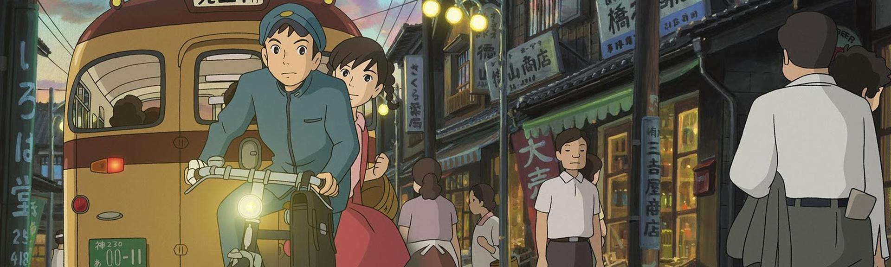
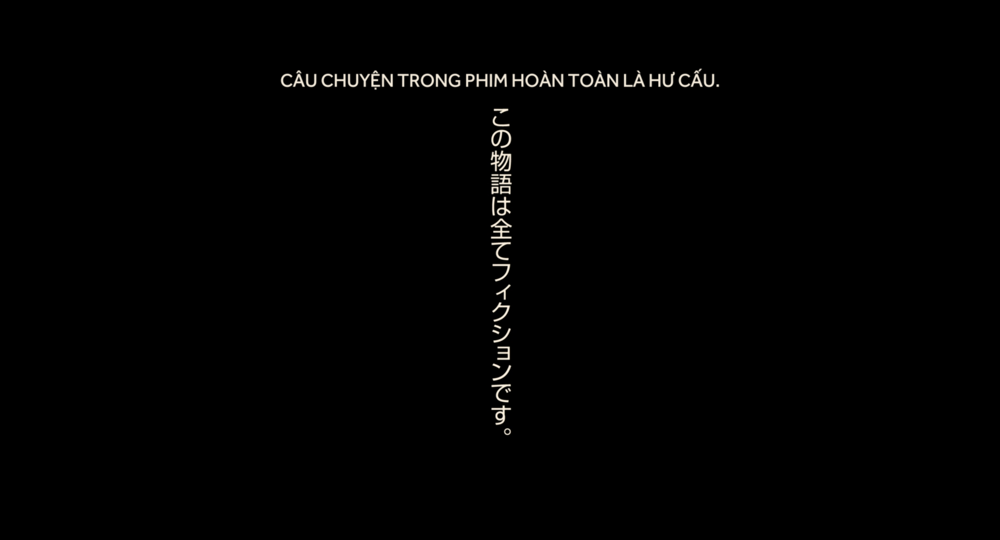
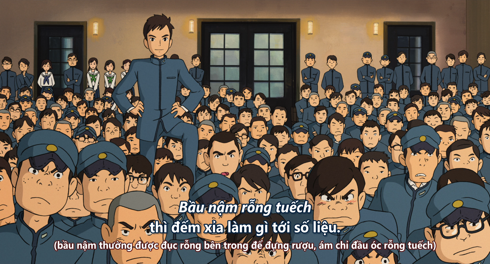

## Kokuriko-zaka Kara (Ngọn đồi hoa hồng anh)

**
Studio: [Studio Ghibli]
**
**
Director: Miyazaki Gorō
**
**
▼ Download ▼
**

[Studio Ghibli]: https://myanimelist.net/anime/producer/21/Studio_Ghibli
[Kyoto Animation]: https://myanimelist.net/anime/producer/2/Kyoto_Animation
[Production I.G]: https://myanimelist.net/anime/producer/10/Production_IG
[Madhouse]: https://myanimelist.net/anime/producer/11/Madhouse
[MAPPA]: https://myanimelist.net/anime/producer/569/MAPPA
[ufotable]: https://myanimelist.net/anime/producer/43/ufotable
[Wit Studio]: https://myanimelist.net/anime/producer/858/Wit_Studio
[Shaft]: https://myanimelist.net/anime/producer/44/Shaft
[Bones]: https://myanimelist.net/anime/producer/4/Bones
[Trigger]: https://myanimelist.net/anime/producer/803/Trigger
[Sunrise]: https://myanimelist.net/anime/producer/14/Sunrise
[CoMix Wave Films]: https://myanimelist.net/anime/producer/291/CoMix_Wave_Films
[Science SARU]: https://myanimelist.net/anime/producer/1591/Science_SARU
[Studio 4°C]: https://myanimelist.net/anime/producer/13/Studio_4%C2%B0C
[OLM]: https://myanimelist.net/anime/producer/28/OLM
[Studio Chizu]: https://myanimelist.net/anime/producer/555/Studio_Chizu
[Toei Animation]: https://myanimelist.net/anime/producer/18/Toei_Animation

## Nhân Lực

- **Dịch**: [KiOZ]
- **Timing**: [KiOZ], [THORA](https://thoranime.nyaarchive.moe/?p=2265)
- **Typsetting**: [KiOZ], [Eagle]
- **Encode**: [THORA](https://thoranime.nyaarchive.moe/?p=2265)
- **QC**: [KiOZ]

[KiOZ]: https://github.com/realKiOZ
[moch1oka]: https://github.com/moch1oka
[tuilakhanh]: https://github.com/tuilakhanh
[Eagle]: https://github.com/MasterEagle2909

## Chú thích dịch

### Trong phim

Tương đối nhiều chú thích, nhưng đều đã ghi cụ thể trong phim.

Bộ phim khá nặng về văn hóa, lấy bối cảnh vào những năm 60 tại Nhật Bản, liên quan tới khắc phục hậu quả sau chiến tranh, một cái nhìn khá nhẹ nhàng chứ không trực diện như [Hotaru no Haka](1988-hotarunohaka.md). 

Cũng vì thế, câu chuyện được kể trong phim khá phổ biến ở Nhật thời kỳ đó, nên cuối phim ta có dòng này. 

### Bầu nậm rỗng tuếch - Ngàn Vạn Quả Bầu

Tiếng Nhật:

    中身のないヒョウタン - 千成瓢箪 (sennaribyōtan)

*thời gian - 0:30:29*

"中身のないヒョウタン" nghĩa đen là "Bầu nậm rỗng", nghe hơi lạ, ở VN thì thường nghe câu "đầu óc rỗng tuếch" hơn. Mình lựa chọn dịch theo nghĩa đen bởi vì nó liên quan đến câu ngay sau đó.

*thời gian - 0:30:32*

"千成瓢箪 (sennaribyōtan)" nghĩa đen là "Một nghìn quả bầu hợp lại", đây là mã ấn [Toyotomi Hideyoshi](https://www.worldhistory.org/Toyotomi_Hideyoshi/), mang hình dạng như chùm bầu nậm. Ý nói "một nghìn ~ một đám".

Thực sự không có cách nào để dịch mớ văn hóa này sang Tiếng Việt mà giữ nguyên vẹn được ý nghĩa.

*Cây cột Sennaribyōtan tại Ga Hyōtan-yama, Higashiōsaka, Ōsaka*

## Tham khảo thêm

## Notes

