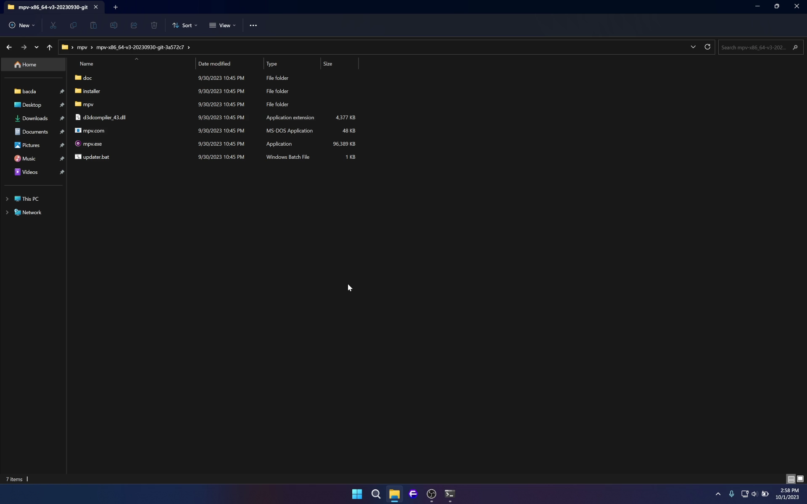

# mpv

# Hướng dẫn cài đặt mpv Windows

## Cài đặt mpv

1. Download bản build mới nhất dành cho Windows tại [zhongfly/mpv-winbuild](https://github.com/zhongfly/mpv-winbuild/releases). Tên file có dạng 
**mpv-x86_64-*.7z**, đối với file có thêm hậu tố **v3** thì sẽ dành cho máy có CPU từ đời **Haswell** (Intel) và **Excavator** (AMD) trở lên, nếu máy bạn đáp ứng đủ điều kiện trên thì nên sử dụng file này để có hiệu năng tối ưu nhất.
2. Sau khi Download các bạn giải nén toàn bộ dữ liệu trong file nén đến folder tuỳ theo ý bạn chỉ định. 
3. Tại folder chứa dữ liệu mà bạn đã giải nén, di chuyển vào có folder **installer** sau đó chạy file **mpv-install.bat** dưới quyền Admin. Sau một lúc thì mpv đã được cài đặt thành công vào máy của bạn, nếu muốn gỡ cài đặt hãy chạy file **mpv-uninstall.bat**.
> **Lưu ý vị trí cũng như tên folder không được thay đổi sau khi đã cài đặt. Nếu bạn muốn di chuyển hay đổi tên thì hãy gỡ cài đặt trước**

## Cài đặt thêm yt-dlp, ffmpeg và cập nhật mpv.

yt-dlp và ffmpeg là hai phần mềm bổ trợ giúp mpv có thể stream video trực tiếp từ Direct Download Link (VD như DDL từ index mà nhóm sử dụng) hoặc xem Video từ YouTube và một số site yt-dlp hỗ trợ thông qua mpv.

1. Tại folder chứa dữ liệu mà bạn đã giải nén, chạy file **updater.bat**. Và ấn phím theo hướng dẫn của script.
1. Tại bước đầu tiên chọn **2** nếu CPU bạn có hỗ trợ v3 như giải thích ở phần cài đặt ngược lại chọn **1**.
1. Tại bước tiếp theo chọn **Y** để xoá file nén sau khi đã giải nén.
1. Tại bước tiếp theo script sẽ tự động tải yt-dlp.
1. Tại bước cuối script sẽ hỏi bạn tài ffmpeg không, chọn **Y** để script cài đặt ffmpeg.

Script **updater.bat** cũng là script dùng để update mpv bạn nên chạy mỗi tuần 1 lần.

## Thêm mpv vào PATH

Nếu bạn muốn sử dụng mpv, yt-dlp và ffmpeg từ command line bạn phải thêm vào Windows PATH:

1. Mở **Windows Settings -> System -> About** và chọn **Advanced System Settings** hoặc có thể gõ **Advanced System Settings** vào Windows Search để mở nhanh mục này.
1. Tại Tab **Advanced** chọn **Environment Variables...**. 
1. Tại **User variables for __** chọn dòng **Path** và chọn **Edit**.
1. Chọn **New** và dán đường dẫn tới folder chứa **mpv.exe**, **yt-dlp.exe**.
1. Chọn Ok sau khi hoàn thành.

## Cài đặt config cho mpv.

1. Tải file portable_config [tại đây](https://github.com/tuilakhanh/mpv-config/releases/).
2. Giải nén với lựa chọn **Extract To portable_config**
3. Copy folder **portable_config** vào folder chứa **mpv.exe**, **yt-dlp.exe**.

Xong các bước trên là bạn đã hoàn thành cài đặt config cho mpv. Tiếp theo bạn cần chỉnh profile tương thích với máy của bạn.

Mở tệp `profiles.conf` trong folder `portable_config` vừa xong, tại dòng **profile=**, sẽ có 3 mức **profile** tương ứng chất lượng hình ảnh và sức mạnh GPU của bạn. Nếu máy sử dụng iGPU từ đời Napoleon thì hãy chỉnh thành **Fast**, nếu máy bạn từ iGPU đời mới thì giữ nguyên mức **Balanced**, nếu bạn sử dụng máy bàn và GPU rời thì hãy chỉnh thành **HighQuality** đề tối ưu hết sức mạnh của GPU.

Config đã đủ các chức năng dành cho người dùng phổ thông, hãy thử duyệt qua từng Menu trên UI để biết thêm các tính năng cũng như là các keybind đã được gán.

Dưới đây là demo một số chức năng:

- Xem trực tiếp từ DDL không cần phải tải về.

- Xem Youtube qua mpv có thể bắt đc 1080p Premium và có thêm filter deband để xoá banding.

Và còn rất nhiều tính năng hữu ích khác như cut video, crop black bar...