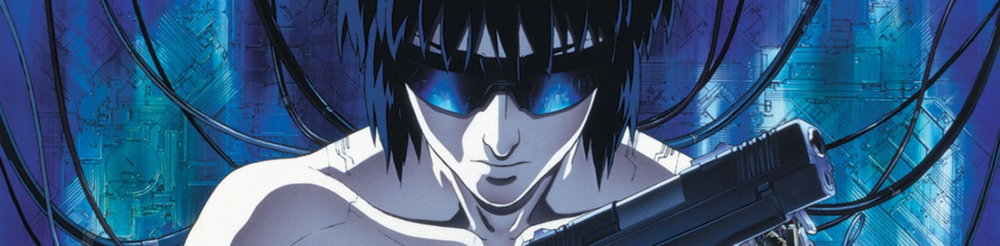

## GHOST IN THE SHELL: Koukaku Kidoutai (Vỏ bọc ma)

**
Studio: [Production I.G]
**
**
Director: Oshii Mamoru
**
**
▼ Download ▼
**

[Studio Ghibli]: https://myanimelist.net/anime/producer/21/Studio_Ghibli
[Kyoto Animation]: https://myanimelist.net/anime/producer/2/Kyoto_Animation
[Production I.G]: https://myanimelist.net/anime/producer/10/Production_IG
[Madhouse]: https://myanimelist.net/anime/producer/11/Madhouse
[MAPPA]: https://myanimelist.net/anime/producer/569/MAPPA
[ufotable]: https://myanimelist.net/anime/producer/43/ufotable
[Wit Studio]: https://myanimelist.net/anime/producer/858/Wit_Studio
[Shaft]: https://myanimelist.net/anime/producer/44/Shaft
[Bones]: https://myanimelist.net/anime/producer/4/Bones
[Trigger]: https://myanimelist.net/anime/producer/803/Trigger
[Sunrise]: https://myanimelist.net/anime/producer/14/Sunrise
[CoMix Wave Films]: https://myanimelist.net/anime/producer/291/CoMix_Wave_Films
[Science SARU]: https://myanimelist.net/anime/producer/1591/Science_SARU
[Studio 4°C]: https://myanimelist.net/anime/producer/13/Studio_4%C2%B0C
[OLM]: https://myanimelist.net/anime/producer/28/OLM
[Studio Chizu]: https://myanimelist.net/anime/producer/555/Studio_Chizu
[Toei Animation]: https://myanimelist.net/anime/producer/18/Toei_Animation
[Tokyo Movie Shinsha]: https://myanimelist.net/anime/producer/65/Tokyo_Movie_Shinsha

## Nhân Lực

- **Dịch**: [KiOZ]
- **Timing**: [KiOZ] (có vài lỗi timing cấn thoại😞)
- **Typesetting**: Không có TS, chỉ \an8
- **Encode**: [Judgment](https://nyaa.si/view/1227680)
- **QC**: [KiOZ]

[KiOZ]: https://github.com/realKiOZ
[moch1oka]: https://github.com/moch1oka
[tuilakhanh]: https://github.com/tuilakhanh
[Eagle]: https://github.com/MasterEagle2909

## Chú thích dịch

Lẽ ra cần nhiều chú thích hơn, nhưng hồi dịch bộ này mình không tìm hiểu mấy nên không note lại, có vài câu trong phim là trích từ danh ngôn, tác phẩm,... chủ yếu liên quan tới triết học.

Tuy nhiên, phần 1 không nặng thoại như [phần 2](../ghost-in-the-shell-02-2004/ghost-in-the-shell-02-2004.md), hình ảnh vẫn vô cùng ẩn dụ. Nói không ngoa, phần 1 ẩn dụ trên từng khung hình, góc máy, và nó không hề ra vẻ hay cố lồng ghép gì cả, rất tự nhiên.

## Tham khảo thêm

[Ghost In The Shell - Film Analysis - Motoko's Dilemma](https://youtu.be/l9v8FzQ2btg) (Youtube Video Essay)

## Notes