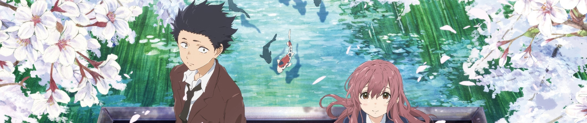
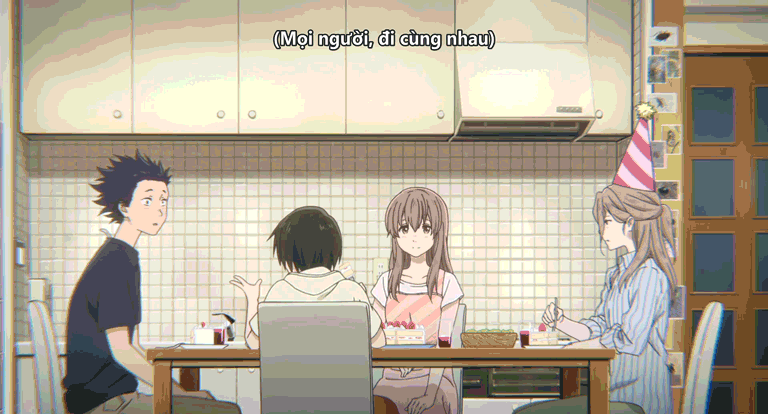

## Koe no Katachi (Dáng hình thanh âm)

**
Studio: [Kyoto Animation]
**
**
Director: Yamada Naoko
**
**
▼ Download ▼
**

[Studio Ghibli]: https://myanimelist.net/anime/producer/21/Studio_Ghibli
[Kyoto Animation]: https://myanimelist.net/anime/producer/2/Kyoto_Animation
[Production I.G]: https://myanimelist.net/anime/producer/10/Production_IG
[Madhouse]: https://myanimelist.net/anime/producer/11/Madhouse
[MAPPA]: https://myanimelist.net/anime/producer/569/MAPPA
[ufotable]: https://myanimelist.net/anime/producer/43/ufotable
[Wit Studio]: https://myanimelist.net/anime/producer/858/Wit_Studio
[Shaft]: https://myanimelist.net/anime/producer/44/Shaft
[Bones]: https://myanimelist.net/anime/producer/4/Bones
[Trigger]: https://myanimelist.net/anime/producer/803/Trigger
[Sunrise]: https://myanimelist.net/anime/producer/14/Sunrise
[CoMix Wave Films]: https://myanimelist.net/anime/producer/291/CoMix_Wave_Films
[Science SARU]: https://myanimelist.net/anime/producer/1591/Science_SARU
[Studio 4°C]: https://myanimelist.net/anime/producer/13/Studio_4%C2%B0C
[OLM]: https://myanimelist.net/anime/producer/28/OLM
[Studio Chizu]: https://myanimelist.net/anime/producer/555/Studio_Chizu
[Toei Animation]: https://myanimelist.net/anime/producer/18/Toei_Animation

## Nhân Lực

- **Dịch**: [KiOZ]
- **Timing**: [KiOZ], [nedragrevev]
- **Typesetting**: [KiOZ], [nedragrevev]
- **Encode**: [Kametsu](https://nyaa.si/view/983165)
- **QC**: [KiOZ]

[KiOZ]: https://github.com/realKiOZ
[moch1oka]: https://github.com/moch1oka
[tuilakhanh]: https://github.com/tuilakhanh
[Eagle]: https://github.com/MasterEagle2909

[nedragrevev]: https://github.com/nedragrevev

## Chú thích dịch

Trong phim có những tình tiết khi các nhân vật giao tiếp với nhau bằng "thủ ngữ - ngôn ngữ ký hiệu" nhưng lại không có phụ đề cũng như thoại diễn giải. Đây là chủ đích của nhà làm phim, bạn không cần phải biết ngôn ngữ ký hiệu mà vẫn có thể thưởng thức trọn vẹn.

Nhưng nếu bạn là một fan, có lẽ bạn cũng như mình, muốn biết thực sự những ký hiệu đó có nghĩa là gì. Vì vậy, mình đã đi tìm hiểu trên các diễn đàn Nhật, cũng như hỏi những người có kiến thức, để từ đó chúng ta có 2 bản phụ đề, lựa chọn tùy ở bạn:

- **Include Shuwa**: bao gồm thủ ngữ.
- **No Shuwa**: không bao gồm thủ ngữ.

*ví dụ về **Include Shuwa***

## Tham khảo thêm

Video Essay của [KiOZ] về một điểm hay trong cinematography của Koe no Katachi:

<iframe style="border-radius: 8px" width="960" height="540" src="https://www.youtube.com/embed/pjnUOx2eOoA" title="YouTube video player" frameborder="0" allow="accelerometer; autoplay; clipboard-write; encrypted-media; gyroscope; picture-in-picture; web-share" allowfullscreen></iframe>

## Notes

