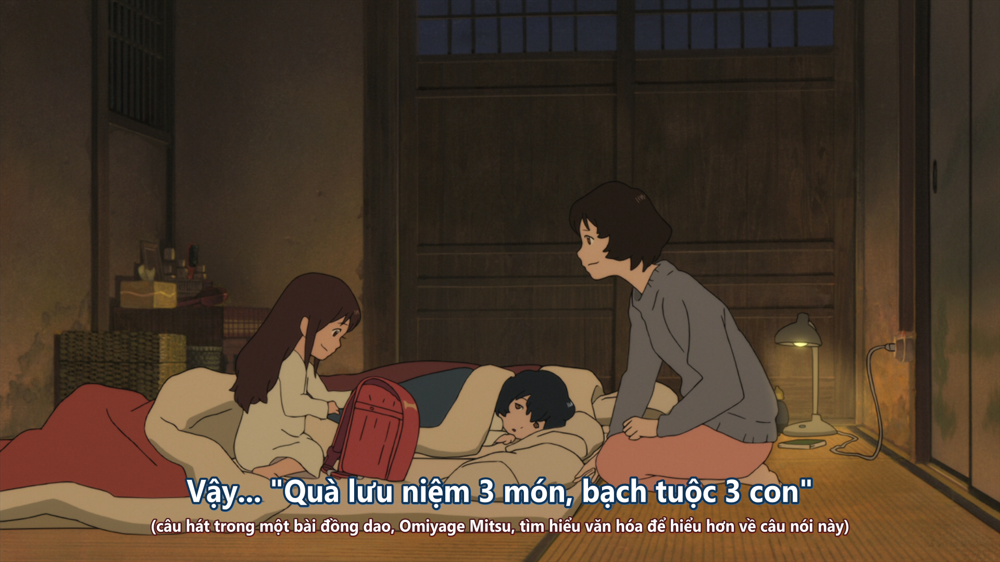
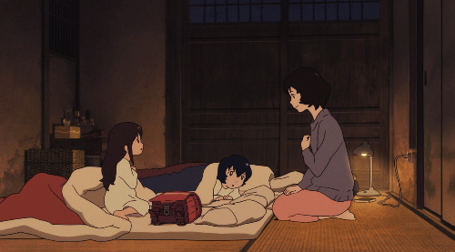
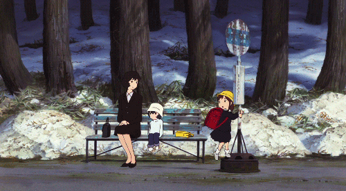

## Ōkami Kodomo no Ame to Yuki (Hai đứa con của sói)

**
Studio: [Studio Chizu]
**
**
Director: Hosoda Mamoru
**
**
▼ Download ▼
**

[Studio Ghibli]: https://myanimelist.net/anime/producer/21/Studio_Ghibli
[Kyoto Animation]: https://myanimelist.net/anime/producer/2/Kyoto_Animation
[Production I.G]: https://myanimelist.net/anime/producer/10/Production_IG
[Madhouse]: https://myanimelist.net/anime/producer/11/Madhouse
[MAPPA]: https://myanimelist.net/anime/producer/569/MAPPA
[ufotable]: https://myanimelist.net/anime/producer/43/ufotable
[Wit Studio]: https://myanimelist.net/anime/producer/858/Wit_Studio
[Shaft]: https://myanimelist.net/anime/producer/44/Shaft
[Bones]: https://myanimelist.net/anime/producer/4/Bones
[Trigger]: https://myanimelist.net/anime/producer/803/Trigger
[Sunrise]: https://myanimelist.net/anime/producer/14/Sunrise
[CoMix Wave Films]: https://myanimelist.net/anime/producer/291/CoMix_Wave_Films
[Science SARU]: https://myanimelist.net/anime/producer/1591/Science_SARU
[Studio 4°C]: https://myanimelist.net/anime/producer/13/Studio_4%C2%B0C
[OLM]: https://myanimelist.net/anime/producer/28/OLM
[Studio Chizu]: https://myanimelist.net/anime/producer/555/Studio_Chizu
[Toei Animation]: https://myanimelist.net/anime/producer/18/Toei_Animation

## Nhân Lực

- **Dịch**: [KiOZ]
- **Timing**: [KiOZ]
- **Typesetting**: [KiOZ]
- **Encode**: [Yousei-raws](https://nyaa.si/view/1290592)
- **QC**: [KiOZ]

[KiOZ]: https://github.com/realKiOZ
[moch1oka]: https://github.com/moch1oka
[tuilakhanh]: https://github.com/tuilakhanh
[Eagle]: https://github.com/MasterEagle2909

[nedragrevev]: https://github.com/nedragrevev

## Chú thích dịch

### Omiyage mittsu tako mittsu

    おみやげ三つ　たこ三つ　- Quà lưu niệm 3 món, bạch tuộc 3 con

Trong phim, đây là "câu thần chú" mà mẹ Hana dạy cho Yuki để "không biến thành sói".

Theo đạo diễn Hosoda Mamoru chia sẻ, thì "Omiyage mittsu tako mittsu" mang ý nghĩa "giữ lời hứa", theo sau còn là câu "Ngoéo tay thề đi, nói láo thì phải uống nghìn cây kim".

Đây cũng là 2 cụm từ trong [bài hát đồng dao](https://youtu.be/nOEjVY8rHE8), một bài hát chơi chữ, bởi "tako" mang nhiều nghĩa, một là "bạch tuộc", hai là "diều", và ba là "vết chai sạn". Ngay trong bài hát còn có câu: 

    たこはたこでも　いたいたこ - Tako là Tako cơ mà Đau-Tako

Tùy bạn hiểu, nhưng thực sự thì cái cảm giác bài hát mang lại không hẳn vui tươi như giai điệu, mà hơi kiểu đùa cợt.

Ở đây thì mình lựa chọn dịch là "bạch tuộc", đơn giản là bởi sở thích thôi, nghe câu "quà lưu niệm 3 món, bạch tuộc 3 con" khá vui, ngoài ra chúng ta đều biết "tako-san - xúc xích bạch tuộc".

~ Quà lưu niệm 3 món, hình phát ra âm thanh 3 tấm ~

## Tham khảo thêm

Một chút về phong cách làm phim của Hosoda ([Youtube](https://www.youtube.com/watch?v=HYcLFVt5uSo&list=PLCXF1KKmIrNMR4VxIy6cNeA-wz2a39kJt&ab_channel=Furin))

## Notes

