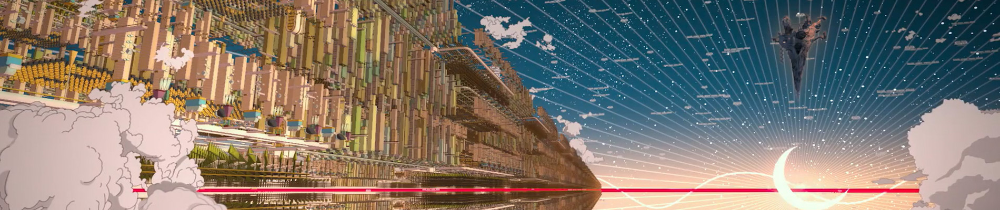

## Ryū to Sobakasu no Hime (Belle)

**
Studio: [Studio Chizu]
**
**
Director: Hosoda Mamoru
**
**
▼ Download ▼
**

[Studio Ghibli]: https://myanimelist.net/anime/producer/21/Studio_Ghibli
[Kyoto Animation]: https://myanimelist.net/anime/producer/2/Kyoto_Animation
[Production I.G]: https://myanimelist.net/anime/producer/10/Production_IG
[Madhouse]: https://myanimelist.net/anime/producer/11/Madhouse
[MAPPA]: https://myanimelist.net/anime/producer/569/MAPPA
[ufotable]: https://myanimelist.net/anime/producer/43/ufotable
[Wit Studio]: https://myanimelist.net/anime/producer/858/Wit_Studio
[Shaft]: https://myanimelist.net/anime/producer/44/Shaft
[Bones]: https://myanimelist.net/anime/producer/4/Bones
[Trigger]: https://myanimelist.net/anime/producer/803/Trigger
[Sunrise]: https://myanimelist.net/anime/producer/14/Sunrise
[CoMix Wave Films]: https://myanimelist.net/anime/producer/291/CoMix_Wave_Films
[Science SARU]: https://myanimelist.net/anime/producer/1591/Science_SARU
[Studio 4°C]: https://myanimelist.net/anime/producer/13/Studio_4%C2%B0C
[OLM]: https://myanimelist.net/anime/producer/28/OLM
[Studio Chizu]: https://myanimelist.net/anime/producer/555/Studio_Chizu
[Toei Animation]: https://myanimelist.net/anime/producer/18/Toei_Animation

## Nhân Lực

- **Dịch**: [KiOZ]
- **Timing**: [KiOZ]
- **Typesetting**: [KiOZ]
- **Encode**: [Anime Land](https://nyaa.si/view/1506216)
- **QC**: [KiOZ]

[KiOZ]: https://github.com/realKiOZ
[moch1oka]: https://github.com/moch1oka
[tuilakhanh]: https://github.com/tuilakhanh
[Eagle]: https://github.com/MasterEagle2909

[nedragrevev]: https://github.com/nedragrevev

## Chú thích dịch

Về thoại, nói chung không có gì quá khó hiểu để chú thích cặn kẽ. 

Về OST, đây mới là vấn đề cần bàn. Theo mình biết, các bài hát trong phim được chuyển lời sang một vài thứ tiếng khác, nên mình nảy ra ý định làm một bản cho Tiếng Việt, cơ mà mới chỉ dừng lại ở mức "nhẩm theo được", tức chuẩn syl, chứ để hát được thì hơi khó. Một phần do ít thời gian, cũng như mình không muốn mắc phải những lỗi lệch nghĩa so với bản gốc như Tiếng Anh hay Tiếng Pháp đã làm. Lói chung là Tạm~

Nhân tiện, đoạn mọi người đồng lòng hát "la la la" là phân đoạn cảm xúc nhất trong năm 2022 của mình, nó không đến từ một câu chuyện đau thương hay dễ lấy nước mắt hay gì cả, bản thân nó đã cảm xúc rồi, nhạc hay quá trời!~

## Tham khảo thêm

Một chút về phong cách làm phim của Hosoda ([Youtube](https://www.youtube.com/watch?v=HYcLFVt5uSo&list=PLCXF1KKmIrNMR4VxIy6cNeA-wz2a39kJt&ab_channel=Furin))

## Notes

