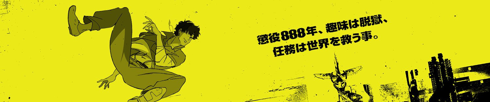

## Lazarus

**
Studio: [MAPPA] 
**
**
Bộ này của thánh [Shinichirō Watanabe](https://www.animenewsnetwork.com/encyclopedia/people.php?id=774), nổi danh với [Cowboy Bebop](https://myanimelist.net/anime/1/Cowboy_Bebop), yên tâm mà xem
**
**
[Staffs](https://www.animenewsnetwork.com/encyclopedia/anime.php?id=29112)
**
**
Tiến độ: 05/13
**
**
▼ Download ▼
**
**
Khuyến khích tải torrent và giữ torrent
**

[Studio Ghibli]: https://myanimelist.net/anime/producer/21/Studio_Ghibli
[Kyoto Animation]: https://myanimelist.net/anime/producer/2/Kyoto_Animation
[Production I.G]: https://myanimelist.net/anime/producer/10/Production_IG
[Madhouse]: https://myanimelist.net/anime/producer/11/Madhouse
[MAPPA]: https://myanimelist.net/anime/producer/569/MAPPA
[ufotable]: https://myanimelist.net/anime/producer/43/ufotable
[Wit Studio]: https://myanimelist.net/anime/producer/858/Wit_Studio
[Shaft]: https://myanimelist.net/anime/producer/44/Shaft
[Bones]: https://myanimelist.net/anime/producer/4/Bones
[Trigger]: https://myanimelist.net/anime/producer/803/Trigger
[Sunrise]: https://myanimelist.net/anime/producer/14/Sunrise
[CoMix Wave Films]: https://myanimelist.net/anime/producer/291/CoMix_Wave_Films
[Science SARU]: https://myanimelist.net/anime/producer/1591/Science_SARU
[Studio 4°C]: https://myanimelist.net/anime/producer/13/Studio_4%C2%B0C
[OLM]: https://myanimelist.net/anime/producer/28/OLM
[Studio Chizu]: https://myanimelist.net/anime/producer/555/Studio_Chizu
[Toei Animation]: https://myanimelist.net/anime/producer/18/Toei_Animation
[TOHO animation STUDIO Anime]: https://myanimelist.net/anime/producer/2705/TOHO_animation_STUDIO

## Nhân Lực

- **Dịch**: [KiOZ]
- **Timing**: [KiOZ]
- **Typesetting**: [KiOZ] - [Hunn]
- **Encode**: WEB-DL
- **QC**: [moch1oka]

[KiOZ]: https://github.com/realKiOZ
[moch1oka]: https://github.com/moch1oka
[tuilakhanh]: https://github.com/tuilakhanh
[Eagle]: https://github.com/MasterEagle2909
[Hunn]: https://github.com/Hunndayne

## Chú thích dịch

## Tham khảo thêm

### Lazarus : 
Tên một nhân vật trong Kinh Thánh, được Jesus hồi sinh như trong Phúc Âm Gioan. Cũng được lấy để đặt tên cho hiện tượng y học khi bệnh nhân bất ngờ sống lại như hồi sinh.

### Người thổi kèn thứ bảy: 
Trong Kinh Thánh, cụ thể là sách Khải Huyền (Revelation), người thổi kèn (hay loa) thứ bảy là một thiên sứ (angel).
Sách Khải Huyền mô tả một chuỗi các sự kiện ngày tận thế, trong đó có bảy thiên sứ thổi bảy chiếc kèn. Tiếng kèn thứ bảy được mô tả trong Khải Huyền 11:15:

"Vị thiên-sứ thứ bảy thổi loa, có những tiếng lớn vang ra trên trời rằng: Từ nay nước của thế-gian thuộc về Chúa chúng ta và Đấng Christ của Ngài, Ngài sẽ trị-vì đời đời."

Như vậy, người thổi kèn thứ bảy là một thiên sứ không được nêu tên cụ thể. Tiếng kèn của vị thiên sứ này không báo hiệu một tai họa mới như sáu tiếng kèn trước, mà là một lời công bố trọng đại về sự thành lập vương quốc đời đời của Đức Chúa Trời và Đấng Christ, đánh dấu sự kết thúc quyền cai trị của thế gian này và sự khởi đầu của sự phán xét cuối cùng và phần thưởng cho những người trung tín.

## Notes
