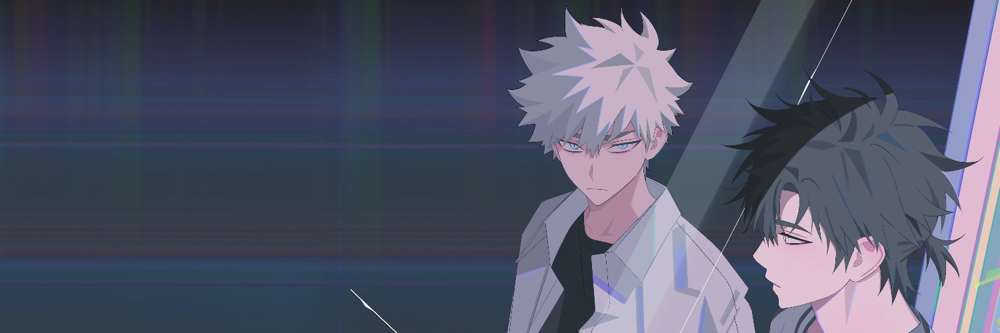

## Link Click (Diện Giả Thời Gian)

**
Studio: [LAN Studio](https://anidb.net/perl-bin/animedb.pl?show=anime&aid=16290)
**
**
💯 BỘ NÀY CỦA TRUNG QUỐC, HAY! 💯
**
**
Tiến độ: Season 01 - 04/11
**
**
▼ Download ▼
**

[Studio Ghibli]: https://myanimelist.net/anime/producer/21/Studio_Ghibli
[Kyoto Animation]: https://myanimelist.net/anime/producer/2/Kyoto_Animation
[Production I.G]: https://myanimelist.net/anime/producer/10/Production_IG
[Madhouse]: https://myanimelist.net/anime/producer/11/Madhouse
[MAPPA]: https://myanimelist.net/anime/producer/569/MAPPA
[ufotable]: https://myanimelist.net/anime/producer/43/ufotable
[Wit Studio]: https://myanimelist.net/anime/producer/858/Wit_Studio
[Shaft]: https://myanimelist.net/anime/producer/44/Shaft
[Bones]: https://myanimelist.net/anime/producer/4/Bones
[Trigger]: https://myanimelist.net/anime/producer/803/Trigger
[Sunrise]: https://myanimelist.net/anime/producer/14/Sunrise
[CoMix Wave Films]: https://myanimelist.net/anime/producer/291/CoMix_Wave_Films
[Science SARU]: https://myanimelist.net/anime/producer/1591/Science_SARU
[Studio 4°C]: https://myanimelist.net/anime/producer/13/Studio_4%C2%B0C
[OLM]: https://myanimelist.net/anime/producer/28/OLM
[Studio Chizu]: https://myanimelist.net/anime/producer/555/Studio_Chizu
[Toei Animation]: https://myanimelist.net/anime/producer/18/Toei_Animation
[TOHO animation STUDIO Anime]: https://myanimelist.net/anime/producer/2705/TOHO_animation_STUDIO

## Nhân Lực

- **Dịch**: [KiOZ] (Chỉnh sửa từ Bilibili, chủ yếu sửa lại câu để giảm CPS, và chỉnh một vài lỗi nhỏ)
- **Timing**: [KiOZ] (retime lại toàn bộ)
- **Typesetting**: [KiOZ], [Dae-P9](https://nyaa.si/view/1648965)
- **Encode**: [Zagzad](https://nyaa.si/view/1453852)
- **QC**: [KiOZ]

[KiOZ]: https://github.com/realKiOZ
[moch1oka]: https://github.com/moch1oka
[tuilakhanh]: https://github.com/tuilakhanh
[Eagle]: https://github.com/MasterEagle2909

## Chú thích dịch

Không dịch OP-ED và Insert, bởi không thạo tiếng Trung. Hiện tại, phụ đề đạt ở mức tiêu chuẩn, bao gồm Thoại và Sign.

## Tham khảo thêm

## Notes

