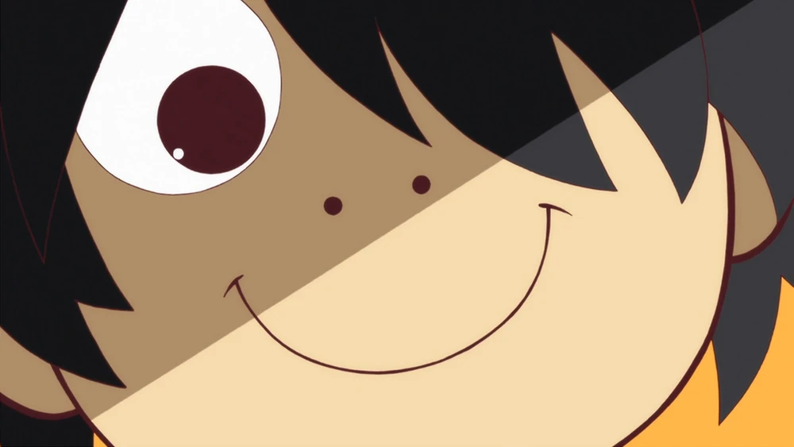
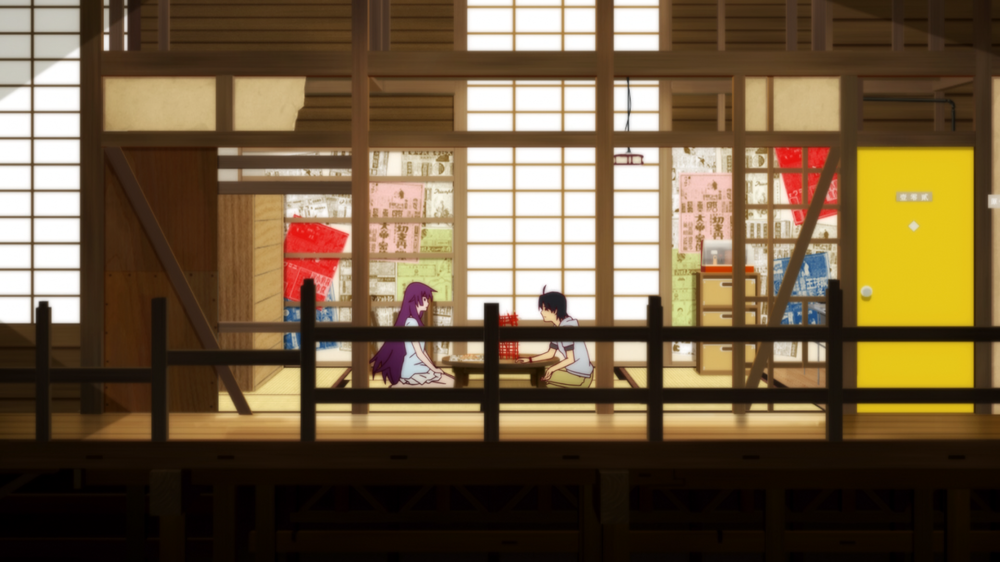
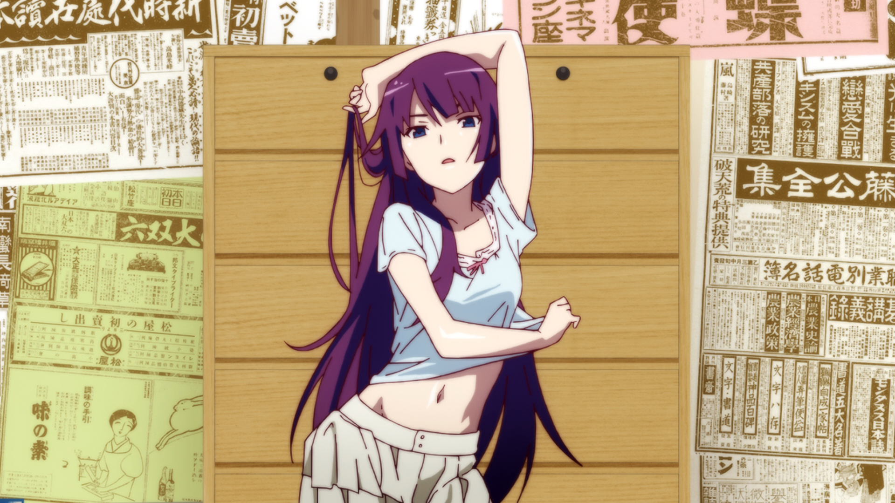
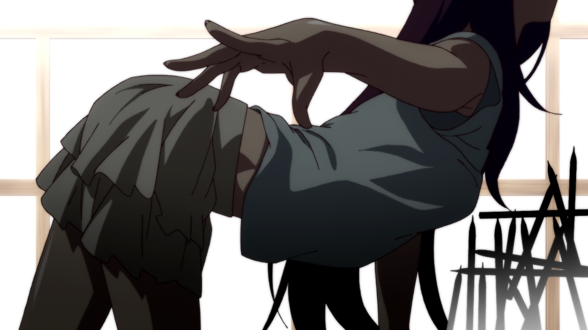
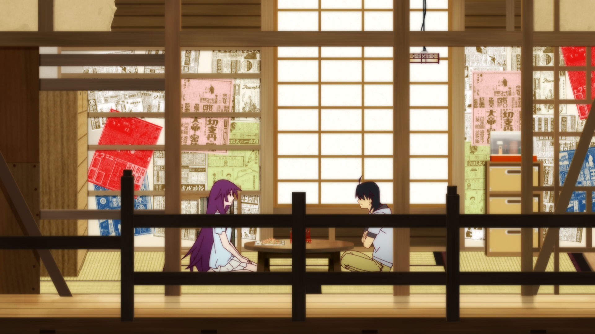
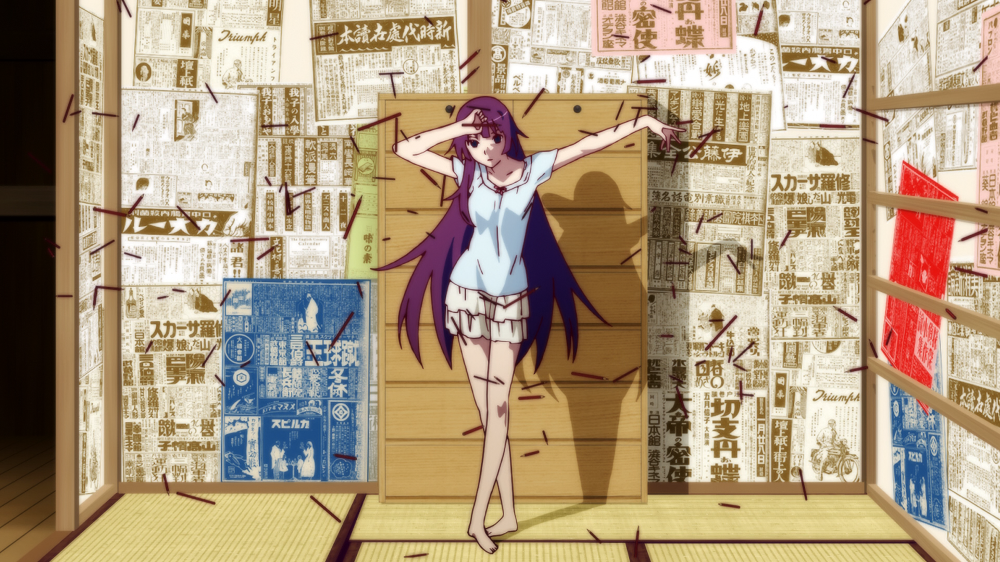
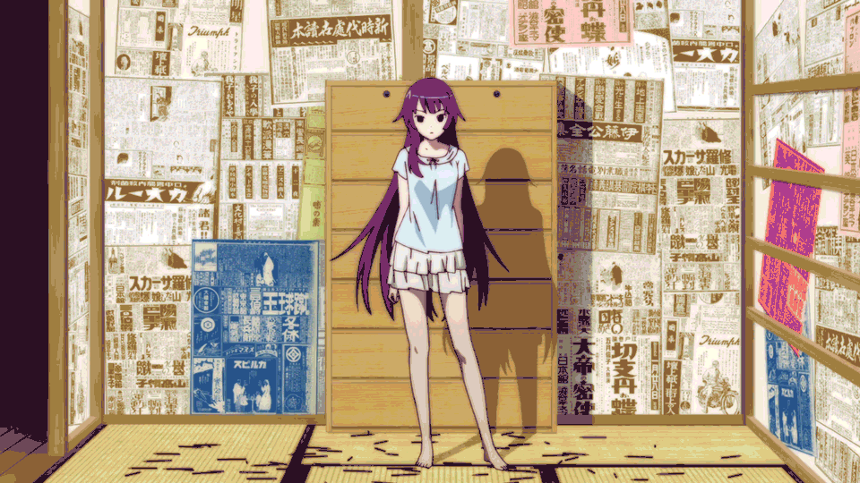

    

## Thông tin chung

Có lẽ khỏi cần giải thích nhiều về việc tại sao nhóm lại pick **Monogatari Series**... Đơn giản là khác biệt. Ở thời điểm hiện tại, nói **Monogatari Series** là **Vô Tiền Khoáng Hậu** cũng không hẳn sai.

Về nội dung, bộ này chú trọng vào các câu thoại tung hứng qua lại, rồi cả chơi chữ và điển tích nữa. Đúng như tên gọi, "Monogatari" có nghĩa là "Truyện", mà truyện thì phải kể, vì thế anime nói tương đối nhiều nếu không muốn nói là rất nhiều, đã thế còn toàn nói đâu đâu, khó hiểu. Chính vì thế nếu khâu hình ảnh không bánh cuốn thì xem sẽ rất dễ chán...

Về hình ảnh, cơ bản anime chuyển thể tương đối sát, khâu hình ảnh không thực sự tạo ra một cái gì đó mang cảm xúc riêng biệt, mà là đại diện cho các câu thoại hay tình huống truyện trong LN, tóm lại giữ nguyên được phong cách của nguyên tác. Cũng vì thế mà anime được vẽ tương đối *gợi dục* y như trong LN @@.

Xét tới animation, **Monogatari Series** không phải hàng thượng hạng, ngoài kia không hiếm các bộ có animation đỉnh, và **Monogatari Series** không nằm trong số đó. Đúng là **Monogatari Series** có vài phân cảnh với animation thượng hạng thật, như là các cảnh hành động võ thuật, hay các cảnh đặc tả nhân vật, nhưng cũng chỉ có thế, phần lớn các cảnh còn lại là tĩnh, hậu cảnh còn làm như cho có. Tóm lại thiếu tính nhất quán trong khâu animation trải dài xuyên suốt cả bộ, như bao bộ tv-anime khác. Về cái **khâu nhất quán** này thì nhóm khuyến nghị, không đâu bằng [Ghibli].

Xét tới Cinematography, tổng thể thì **Monogatari Series** dừng ở mức *khá-cận-giỏi*, nhìn xuống thì hơn nhiều bộ tv-anime, nhìn lên thì thua nhiều bộ movie. Nhưng động đến Editing (Dựng phim) thì là câu chuyện hoàn toàn khác. Đây cũng là điểm mấu chốt khiến **Monogatari Series** trở nên khác biệt. Nó bổ trợ cực nhiều cho các nhân vật trong anime, nhân vật hưởng lợi nhiều nhất, không ai khác chính là Hitagi. 

Về khâu Editing trong **Monogatari Series** thì trước tiên phải thừa nhận nó **cực kỳ dễ**, không đùa đâu. Nó cực dễ, nhưng cực độc. Nó dễ bởi cũng như các bộ tv-anime khác, **Monogatari Series** cũng cắt cảnh qua lại *liên tọi*. Sự khác biệt nằm ở các cảnh được chiếu sau mỗi lần cắt, đây là một ví dụ điển hình mà bạn sẽ thấy rất nhiều lần trong phim:

<b> Cảnh 1 </b>   
Hitagi đang ngồi bình thường.

<b> Cảnh 2 </b>   
Sau khi chiếu 1 vài cảnh tượng trưng khó hiểu, thì nhảy cóc tới cái tư thế này.

<b> Cảnh 3 </b>   
Tiếp túc nhảy cóc tư thế sau một vài cảnh tượng trưng.

<b> Cảnh 4 </b>   
Trở về ngồi bình thường, vẫn không thấy animation đâu cả.

<b> Cảnh 5 </b>   
Như cảnh 2, tự dưng đâu ra cái tư thế ảo ma này.

 
 

 

Do thiếu đi gần như toàn bộ các animation giữa các tư thế khác nhau, chỉ có các câu thoại là đảm bảo tính liên tục, còn animation cho nhân vật thì nhảy cóc. Nó tạo ra các khoảng trống về tính liên tục trong hành động của nhân vật, thế vào những khoảng trống đó là những cảnh tượng trưng, có cảnh dùng để ẩn dụ, có cảnh dùng để tạo nhịp điệu nhanh dồn dập, nói chung là tùy mục đích. Điều này khiến khán giả hơi khó nắm bắt một chút, ảnh gif sau đây là một cảnh liền mạch, cũng thể hiện tương đối tốt sự khó nắm bắt đó:

Điểm tiếp theo, cũng được fast-cut (cắt cảnh nhanh) như cảnh ở trên, điểm này thì có lẽ ai cũng biết khi xem Monogatari:

Phải, đó là cắt cảnh nhanh sang những khung hình chỉ có "tiêu đề", có lúc còn có mỗi chữ "Khung hình Đen/Đỏ/Trắng/Vàng/Xanh/..."

Đây là 2 điểm quan trọng nhất khiến **Monogatari Series** trở nên khác biết so với phần còn lại. Cái kiểu Editing khó nắm bắt, kích thích tò mò đi kèm với nội dung cùng nhân vật huyền bí thì nó gọi là Song Kiếm Hợp Bích rồi. 

Chưa kể, do bản chất của **Monogatari Series** là "thoại, thoại, và thoại", đây là giá trị cốt lõi từ LN rồi, nên khi chuyển thể anime, không nên phá hỏng cái phong cách này. Với **Monogatari Series** thì các câu thoại đóng vai trò giống như các "đường kiếm, đòn đánh, phát bắn" trong phim hành động. Chính vì thế, việc lựa chọn Editing theo kiểu dồn dập là cần thiết để khiến anime không bị lê thê gây nhàm chán.

Và với 2 điểm vừa rồi, các bạn có thấy nó khó không? Ngược lại còn rất dễ ấy chứ, đặc biệt là những cảnh cắt qua "tiêu đề", kiểu làm này tiết kiệm nhiều công sức trong công đoạn sản xuất của tv-anime vốn đã không có nhiều thời gian như movie, bởi không phải vẽ quá nhiều animation. [KiOZ] gọi đây là kiểu "Editing giật mà mượt cục", tức "giật cục một cách mượt mà" (lol).

Dễ là thế, hiệu quả và phù hợp là thế, nhưng tuyệt nhiên không thấy các bộ anime khác học theo, cho dù [Bakemonogatari] đã ra mắt năm 2009, cũng chả phải mới mẻ gì. Điều này cho thấy một chữ "độc". Nếu có bộ nào đó bắt trước, thì đó cũng chỉ là dạng homage hay reference cho thú vị mà thôi, chứ không thể áp dụng xuyên suốt mặc cho lối Editing này vô cùng dễ. Trong cái ngành phim phọt này, phim nào mà phát minh ra kỹ thuật gì mới hay ho là người ta học lấy học để, rồi áp dụng và xào nấu lại liền. Nhưng với kỹ thuật vừa dễ, vừa rẻ này của **Monogatari Series** thì lại không thấy ở đâu áp dụng. Âu cũng bởi nó quá dễ và cơ bản, dễ đến mức dễ sợ, người ta nhìn cái là nhận ra liền, nên nào dám "trôm".

Tóm lại, **Monogatari Series** đã tạo ra một phong cách "Cực Dễ nhưng Cực Độc", mà yếu tố quan trọng nhất chính là Editing.

## Danh sách các phần của Monogatari Series

1. [Bakemonogatari (2009)](01-bake-2009/01-bake-2009.md)
2. [Kizumonogatari (2016)](02-kizu-2016/02-kizu-2016.md)
3. [Nisemonogatari (2009)](03-nise-2012/03-nise-2012.md)
4. ...
5. ...

[Nichijō]: https://myanimelist.net/anime/10165/Nichijou
[KareKano (1998)]: https://myanimelist.net/anime/145/Kareshi_Kanojo_no_Jijou
[KareKano]: https://myanimelist.net/anime/145/Kareshi_Kanojo_no_Jijou
[Danshi Kōkōsei no Nichijō]: https://myanimelist.net/anime/11843/Danshi_Koukousei_no_Nichijou

[Ghibli]: ../../ghibli/ghibli-studio.md
[Bakemonogatari]: 01-bake-2009/01-bake-2009.md

[KiOZ]: https://github.com/realKiOZ
[moch1oka]: https://github.com/moch1oka
[tuilakhanh]: https://github.com/tuilakhanh
[Eagle]: https://github.com/MasterEagle2909

