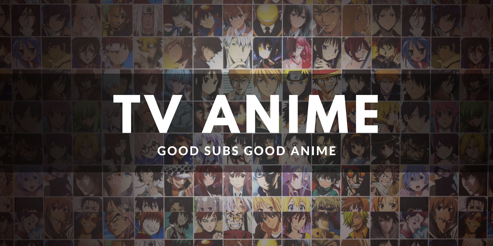

## Thông tin chung

Không như mục [Movies] là sân chơi chính, mục [TV-Anime] này chỉ là kép phụ. Với việc bản quyền anime đang ngày một lớn mạnh ở VN, thì nhóm gần như sẽ không pick **anime series**. Vốn ban đầu nhóm cũng chỉ định hoàn thành nốt [Kaguya-sama] và đặc biệt là [Monogatari Series].

Đôi chút về [Kaguya-sama] và [Monogatari Series] thì hai bộ này nếu chiếu theo cái "tiêu chuẩn điện ảnh" ở bên mục [Movies] thì có lẽ cả hai đều bị loại, đây đang đánh giá về mặt hình ảnh nha, không phải kịch bản hay nội dung, còn đương nhiên thì nội dung rất quan trọng rồi. Lý do tại sao nhóm pick hai bộ này thì bạn có thể xem ở page riêng cho từng bộ, hai bộ mà nhóm xin đảm bảo là sẽ đi tới cùng trời cuối đất.

## Danh sách tv-anime đã đang và sẽ làm

- [Kaguya-sama]
- [Monogatari Series]
- Tengoku daimakyō (delay ở khâu dịch)
- [Kusuriya no Hitorigoto]

[Monogatari Series]: monogatari-series/monogatari-series.md
[Kaguya-sama]: kaguya-sama/kaguya-sama.md
[Kusuriya no Hitorigoto]: kusuriya-no-hitorigoto/kusuriya-no-hitorigoto.md

[Movies]: ../movies/movies.md
[TV-Anime]: tv-anime.md
[Ghibli]: ../ghibli/ghibli-studio.md

[KiOZ]: https://github.com/realKiOZ
[moch1oka]: https://github.com/moch1oka
[tuilakhanh]: https://github.com/tuilakhanh
[Eagle]: https://github.com/MasterEagle2909